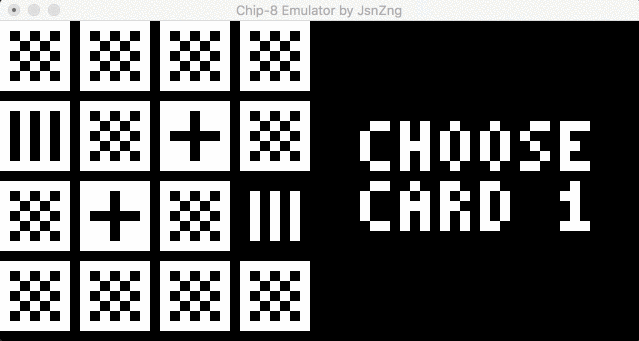

# Chip-8 Emulator
This is a Chip-8 emulator written in C++. The implementations are based on [Chip-8 Wikipedia](https://en.wikipedia.org/wiki/CHIP-8).

### Screenshot

### Platform
Only executable in Mac now. Should be easy to support other platforms in the future since there are only few platform-specific implementations.

### controls
Original Chip-8 uses hex inputs, 0x1 - 0xF. This implementation uses the following inputs for convenience.

| | | | |
|---|---|---|---| 
|1|2|3|4|  
|Q|W|E|R|  
|A|S|D|F|
|Z|X|C|V|  

### Graphics
Graphic display is achieved by using OpenGL.  
FPS is set to ~60 although I didn't find any sources regarding the refreshing rate of the original Chip-8.  

### Sound
Not supported yet.